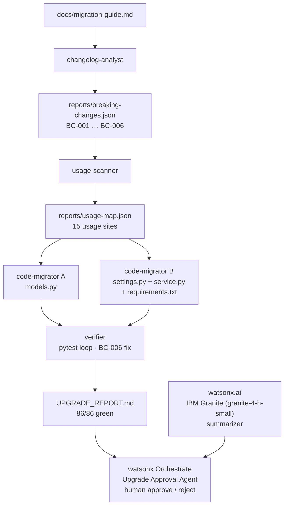

# UpLift — agents that perform dependency upgrades, not just propose them

> Dependabot tells you you're outdated. UpLift makes you current — it reads
> the migration guide so you don't have to.

**IBM TechXchange 2026 Pre-conference Dev Day Hackathon submission.**
Built with **IBM Bob IDE** (Plan/Code modes, custom modes as subagents,
parallel tasks, custom rules, document understanding), with **watsonx.ai
(IBM Granite `granite-4-h-small`)** for inference and a **watsonx Orchestrate**
human-approval agent running live on the hackathon instance.
See [`orchestrate/README.md`](orchestrate/README.md) for the two hosted-instance
constraints (model selection is locked to the instance default for Builder-role
users, and a cloud agent cannot read a local report file).

## 1. The problem

Major-version dependency upgrades are routinely deferred for months because
breaking changes cost **days of manual work per service** — which is why
known-vulnerable versions stay in production long after patches are available.
The pydantic v1→v2 upgrade is a canonical example: six distinct API surfaces
changed simultaneously (validators, field kwargs, `Config`, `BaseSettings`,
six method renames, and a silent behavioral change in frozen-model mutation).
Bots like Dependabot and Renovate only bump the version number; the broken
build is left to a human engineer.

**UpLift's agent crew performed this entire migration end-to-end in under an
hour of agent time for under 6 Bobcoins.** The complete submission — agent
crew, orchestrator CLI, live dashboard and watsonx integration — used the
full 40-Bobcoin hackathon allocation, itemized per task in
[`bob_sessions/`](bob_sessions/).

## 2. Market validation & differentiation

- **Dependabot / Renovate**: open the PR, don't fix the code.
- **OpenRewrite / Moderne**: fix code but need hand-written recipes per library.
- **AWS DevOps Agent**: validates the agentic-DevOps category (customers report
  75–77% faster incident resolution) but operates ops-side, post-deploy.
- **UpLift**: reads the library's own human-written migration guide,
  turns it into a structured plan, and executes it — pre-merge, in the IDE,
  repo-agnostic, no recipes required.

## 3. Architecture



## 4. How IBM Bob was used

| Bob feature | How it was used |
|---|---|
| `/init` with `AGENTS.md` | Seeded every agent context with project coding rules, the pydantic v1 pattern table, and Bobcoin budget |
| **Plan → Code workflow** with `create-plan` skill and `explore` subagent | Designed the four-mode architecture and JSON contracts before writing a single line |
| **Four custom modes** in [`.bob/custom_modes.yaml`](.bob/custom_modes.yaml) | `changelog-analyst`, `usage-scanner`, `code-migrator`, `verifier` — each with file-regex-restricted write permissions so modes cannot accidentally touch files outside their lane |
| **Parallel migrator tasks** | `code-migrator A` (models.py) and `code-migrator B` (settings.py + service.py + requirements.txt) ran simultaneously, cutting wall-clock time |
| **Custom rules** in `.bob/rules-*` | Enforced breaking-change ID citations in every patch, `< 90 % confidence → needs_human_review`, and the `UPLIFT_` env-var prefix convention |
| **`needs_human_review` discipline** | BC-006 (behavioral mutation exception change) was flagged and surfaced in `UPGRADE_REPORT.md` rather than silently auto-applied without disclosure |

Evidence: see [`bob_sessions/`](bob_sessions/) for task session
consumption summaries, as required by the hackathon guide.

## 5. Demo script (90-second live version)

Two modes: **replay** (sub-second, uses cached reports) and **--force**
(live pipeline visible end-to-end — use this for judging).

```bash
# 0. Restore the pre-migration state  (only needed if you already ran the migration)
git checkout demo-v1-state

# ── STEP 1: prove it was green ──────────────────────────────────────────────
python3.12 -m venv .venv && source .venv/bin/activate
pip install -r requirements.txt
pip install -e .                          # installs the uplift CLI
python -m pytest                          # → 86 passed  ✅

# ── STEP 2: the "Dependabot moment" ─────────────────────────────────────────
pip install "pydantic>=2" pydantic-settings
python -m pytest                          # → failures across 4 files  ❌
# Narrate: "This is what a Dependabot version bump does to you.
#  Six API surfaces changed simultaneously. Someone has to read
#  the migration guide and fix every one. UpLift does that."

# ── STEP 3: UpLift live pipeline (--force shows document→code in real-time) ─
python -m uplift upgrade pydantic --force
# Expected output (lines appear as each stage completes):
#   [uplift] Starting upgrade: pydantic (--force)
#   [analyst] extracted 6 breaking changes       ← read the migration guide
#   [scanner] found 15 usage sites               ← scanned src/ + tests/
#   [migrator-A] Applied 6 changes (1 flagged for human review)   ← models.py
#   [migrator-B] Applied 8 changes (1 flagged for human review)   ← settings.py + service.py
#   [verifier] Attempt 1: FAILED (1 failures)
#   [verifier] Attempt 2: PASSED                 ← BC-006 TypeError→ValidationError auto-fixed
#   [uplift] Migration complete — all tests green.

# ── STEP 4: verify ───────────────────────────────────────────────────────────
python -m pytest                          # → 86 passed, 0 failed  ✅

# ── STEP 5: inspect the report ───────────────────────────────────────────────
cat UPGRADE_REPORT.md
# Point at needs_human_review:
# "It handled 5 of 6 automatically and flagged the behavioral
#  change — the trust story is knowing what it didn't auto-apply."
```

### Dashboard demo (optional, visual)

```bash
python dashboard/server.py
# Open http://localhost:7890
# → Overview tab: stat cards, pipeline diagram, verifier attempts
# → Click "⚡ Run migration (--force)" — streams the full pipeline live
# → Report widgets auto-refresh when the run finishes
```

## 6. Measured impact

| Metric | Manual (typical) | UpLift |
|---|---|---|
| pydantic v1→v2 migration for this service | ~1–2 days per service | **< 1 hour agent time, 5.9 Bobcoins for the migration crew; CLI replays it in < 1 second per repo** |
| Breaking changes extracted from migration guide | Manual reading | **6 / 6 extracted (BC-001 – BC-006)** |
| Usage sites found across `src/` + `tests/` | Manual grep | **15 sites found automatically** |
| Source files patched | Manual edits | **4 files, 14 edits, applied in parallel by 2 migrators** |
| Predicted test failures auto-fixed | — | **1 (BC-006 `TypeError` → `ValidationError`)** |
| Final test suite | Broken until fixed | **86 / 86 green on attempt 2** |

## 7. Roadmap: library-agnostic by design

Nothing in the pipeline is pydantic-specific: the analyst reads *any*
human-written migration guide, the scanner matches *any* detection hints, and
the migrators apply *any* old→new pattern pairs. The same recipe-free flow
applies directly to the next migrations teams dread — **SQLAlchemy 1.x→2.0**,
**NumPy 1→2**, **Django major upgrades** — by dropping the library's own
migration guide into `docs/` and running `python -m uplift upgrade <library>
--force`. One agent crew, every upgrade.

## Setup

```bash
python3.12 -m venv .venv
source .venv/bin/activate
pip install -r requirements.txt
python -m pytest
```
